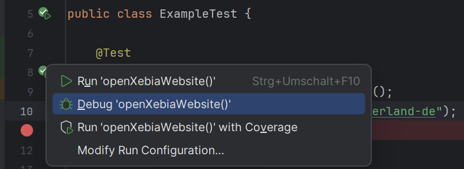
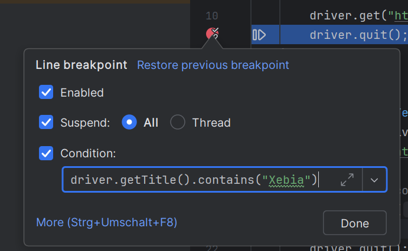

# Debugging Selenium Tests (Java + IntelliJ)

While slowing down tests can help visualize what’s happening, sometimes you need to zoom into specific test steps, especially when something fails.

This section will teach you how to debug Selenium tests using IntelliJ IDEA and Java.

---

## Exercise: Running in Debug Mode

You can debug any JUnit test directly from IntelliJ.

1. Open your test class, e.g. `ExampleTest.java`
2. Set a breakpoint by clicking in the gutter next to a line (e.g., after `driver.get(...)`)
3. Right-click the test method → choose **"Debug 'methodName'"**

The test will start in debug mode. When the breakpoint is hit, the execution will pause and allow you to inspect the browser state, step through code, or evaluate expressions.

---

## Exercise: Using a Debugger in IntelliJ

IntelliJ IDEA provides powerful debugging capabilities. You can:

- Step into / over methods
- Inspect variables like `WebElement`
- View call stacks
- Evaluate expressions during a paused state

Try this:
1. Set a breakpoint on `driver.get(...)`
2. Run the test in debug mode
3. When it pauses, inspect the `driver` and it's values

---

## Exercise: Advanced Debugging with Conditions

You can also use conditional breakpoints in IntelliJ:
- Right-click a breakpoint
- Add a condition like: `driver.getTitle().contains("Xebia")`

This ensures the debugger stops **only** when that condition is met. (In this case, the title of the current website must contain the value `Xebia`.)

---

## Summary

- Use **breakpoints** to inspect and step through test execution
- Debug directly in **IntelliJ IDEA** without extra tools
- Conditional breakpoints help narrow down problems

👉 Next up: record a test case and test your own SUT with selenium.
